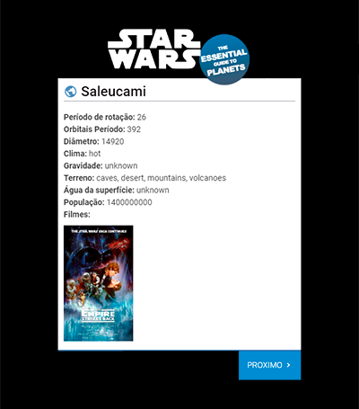

# Star Wars Teste

Olá jovem Padawan, rodar o projeto você deve...

## Start

Para isso você não precisa usar a força muito menos ter um sabre multicolorido, então vamos lá:

1- Clonar o projeto no seu local.

2- Abrir o diretório no terminal.
```
cd [diretorio]
```
3- Instalar as dependências do projeto.
```
npm install
```
4- Agora é só rodar o projeto.
```
npm run dev
```
5- Agora a página deve aparecer automaticamente no endereço http://localhost:8080/

## Sobre o projeto

Projeto teste para B2W, foi realizado usando Vue.js. Tem como objetivo ajudar todos que estão perdidos pela galáxia ou que só procuram uma rota melhor para chegar na corrida de naves.

Com um designer simples e intuitivo a ideia é, quando o usuário clicar no botão "próximo" aparecerá as informações sobre um planeta aleatório que pertence ao nosso mais completo guia de planetas da franquia Star Wars.

<center></center>

Que a força esteja com você.
